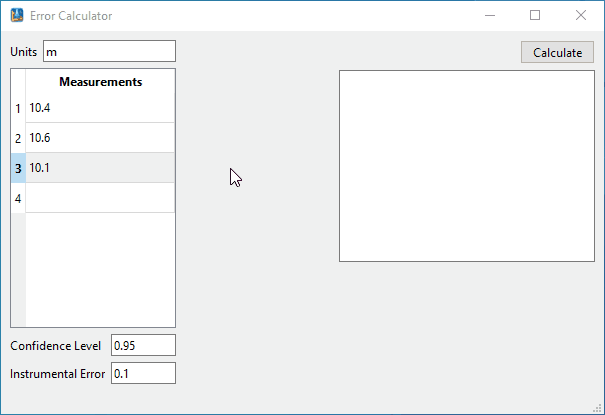

[🇬🇧 **English**](README.md) | [🇺🇦 **Українська**](README.uk.md)


---

# 📊 Error Calculator

**Error Calculator** is a desktop C++/Qt application designed to automate the statistical processing of measurement results, calculating errors, and Student's t-coefficients.

### 🎬 Demo / Демонстрація роботи



### 📸 Interface Preview / Інтерфейс програми


---

## 🚀 Key Features

* **Statistical Analysis:** Calculation of the arithmetic mean, variance, standard deviation, and absolute error.
* **Student's Distribution:** Accurate calculation of Student's t-coefficient using the **Boost.Math** library.
* **Dynamic Data Table:** Convenient sample input, dynamic data correction, and handling of invalid values.
* **Interactive Interface:** Intelligent validation and auto-correction of entered data upon loss of focus or editing.
* **Convenient Installer:** A ready-to-use Windows installer with the capability for automatic deployment of the Microsoft Visual C++ Redistributable.

---

## 🛠 Technology Stack

* **Programming Language:** C++17
* **Framework:** Qt 6 (Widgets)
* **Build System:** CMake (3.19+)
* **Additional Libraries:** Boost
* **Compiler:** MSVC (Visual Studio 2026)
* **Distribution Packager:** Inno Setup 6

## 🛠 Installation and Build

### 📦 Option 1: Using the ready-made installer

Run the `ErrorCalculator_Setup_v0.1.exe` file and follow the installation wizard instructions for a quick application setup.

---

### ⚙️ Option 2: Building from source code via CMake

1. **Download Source Data:** Clone the repository with the project. Download and extract the [Boost 1.92.0](https://archives.boost.io/release/1.92.0/source/boost_1_92_0.zip) library archive.
2. **Specify Boost Path:** Open `CMakeLists.txt` in the project root and specify the path to the directory where Boost is extracted by adding the lines: `set(Boost_ROOT "C:/Path/to/boost_1_92_0")` and `set(BOOST_ROOT "C:/Path/to/boost_1_92_0")`.
3. **Prepare the Terminal:** Open the **Qt 6.x (MSVC 2022)** terminal *(you can also use Qt MinGW, MSYS2 Shell, or a standard CMD/PowerShell if all dependencies are added to the PATH)* and navigate to the project folder using the command `cd "C:\Path\to\project"`.
4. **Compile the Project:** Configure the project with the command `cmake -B build -S . -DCMAKE_BUILD_TYPE=Release`, and then build it: `cmake --build build --config Release`.
5. **Final Build and Deployment:** Navigate to the compiled project folder `cd build` and execute the installation command: `cmake --install . --prefix "C:\Path\to\install"`. The `--prefix` parameter specifies the path to the folder where the fully standalone application will be deployed along with all necessary Qt `.dll` files.

---

### 🎨 Option 3: Using Qt Creator

1. Clone the project and download the [Boost](https://archives.boost.io/release/1.92.0/source/boost_1_92_0.zip) archive.
2. Launch **Qt Creator** and open the project via the `CMakeLists.txt` file.
3. In the `CMakeLists.txt` file, specify the path to the Boost folder by adding the variables `set(Boost_ROOT "C:/Path/to/boost")` and `set(BOOST_ROOT "C:/Path/to/boost")`.
4. Start the project build in the **Release** configuration (`Ctrl + B`).
5. Open the Qt 6.x (MSVC 2022) terminal, navigate to the build folder `cd build`, and run the deployment command: `cmake --install . --prefix "C:\Path\to\install"`.

---

## 📁 Project Structure

```text
Error_calculator/
├── src/                  # C++ source files (.cpp, .h)
│   ├── main.cpp          # Entry point
│   ├── mainwindow.cpp    # Main window logic
│   └── datatable.cpp     # Table model and data processing
├── ui/                   # Qt Designer GUI files (.ui)
│   └── mainwindow.ui
├── resources/            # Application icons and resources (.rc, .ico)
├── installer/            # Inno Setup script (.iss) for installer creation
├── CMakeLists.txt        # CMake configuration file
└── .gitignore            # Git exclusions